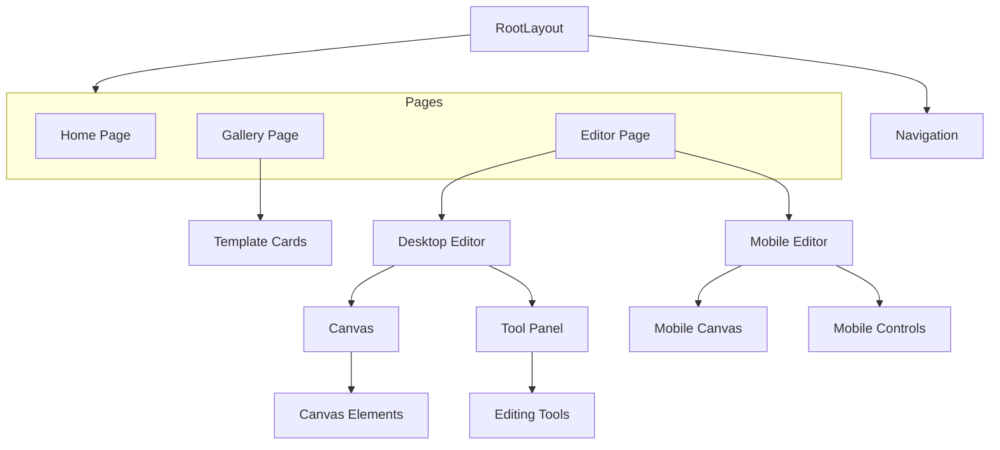

# System Patterns

## Architecture
- **Next.js App Router**: Utilizing the newest file-based routing system
- **React Server Components**: Default approach for components
- **Client Components**: Used selectively where client-side interactivity is needed
- **Canvas Library**: To be selected for the menu card editor functionality

## Key Design Patterns
- **Component-Based Architecture**: UI organized as reusable React components
- **Server-First Approach**: Leveraging Server Components for improved performance
- **Page/Layout Pattern**: Pages with shared layouts using Next.js App Router
- **Editor/Canvas Pattern**: Specialized components for the menu card editor

## Component Relationships

## Code Organization
- **App Directory Structure**:
  - `/app`: Main application code
    - `/page.tsx`: Home page component
    - `/gallery/page.tsx`: Gallery page for templates
    - `/editor/page.tsx`: Main editor page
    - `/editor/mobile/page.tsx`: Mobile-optimized editor
  - `/components`: Reusable UI components
    - `/ui`: Generic UI components
    - `/editor`: Editor-specific components
    - `/gallery`: Gallery-specific components
  - `/lib`: Utility functions and shared logic
  - `/styles`: Global styles and Tailwind configuration
  - `/public`: Static assets including logo and template images
  
## Styling Approach
- **Tailwind CSS**: Used for utility-first CSS approach
- **CSS Variables**: For theme configuration (light/dark mode)
- **Responsive Design**: Mobile-first approach with specialized components for different screen sizes 